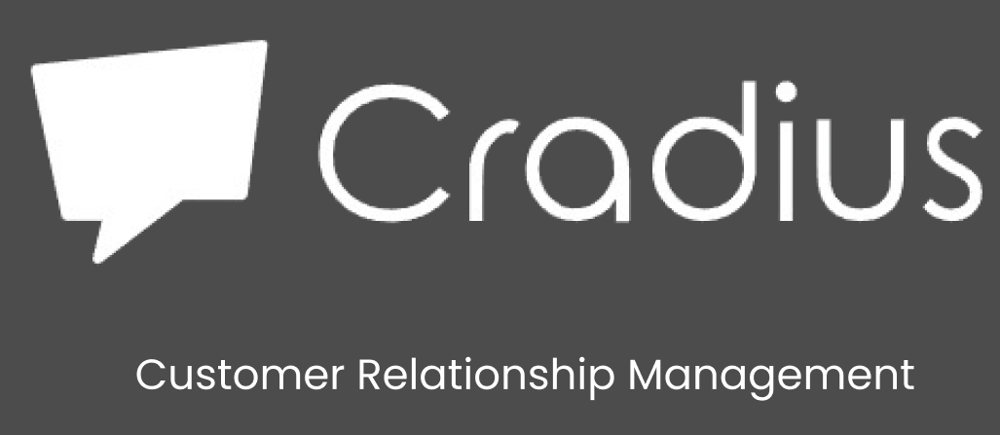

# Cradius - Professional CRM Mobile App

<div align="center">
  
  
  [](https://flutter.dev/)
  [](https://firebase.google.com/)
  [](LICENSE)
</div>

## 📱 About Cradius

**Cradius** is a comprehensive Customer Relationship Management (CRM) mobile application built with Flutter. Designed for sales professionals, account managers, and small business owners, it provides a complete solution for managing leads, follow-ups, tasks, and business communications.

## ✨ Key Features

### 🔐 **Authentication & Onboarding**
- **Firebase Phone Authentication** with OTP verification
- **Multi-step Onboarding** with interactive tutorials
- **Secure User Management** with profile customization
- **Social Login Integration** (Google, Apple)

### 📊 **Smart Dashboard**
- **Real-time Statistics** for leads, tasks, follow-ups, and messages
- **Dynamic Content Display** based on priority and urgency
- **Context-aware Welcome Messages** with actionable insights
- **Quick Access Navigation** with notification badges

### 📞 **Call Management**
- **Complete Call History** with incoming, outgoing, and missed calls
- **Interactive Dialpad** for direct calling
- **Call Duration Tracking** and contact management
- **Search & Filter** functionality for call logs
- **Direct Phone Integration** with device calling features

### 📋 **Task Management**
- **Priority-based Task System** (High, Medium, Low)
- **Smart Filtering** (All, Pending, Completed, Overdue)
- **Due Date Tracking** with overdue notifications
- **Task Operations**: Create, edit, delete, duplicate, toggle completion
- **Visual Priority Indicators** with color-coded system
- **Task Statistics & Analytics**

### 👥 **Follow-up Management**
- **Complete CRUD Operations** for follow-up scheduling
- **Status Tracking** (Open, In Progress, Completed, Cancelled)
- **Date & Time Scheduling** with intuitive pickers
- **Real-time Dashboard Integration** with live statistics
- **Detailed Follow-up Forms** with rich data entry

### 👤 **Profile & Settings**
- **User Profile Management** with editable information
- **Comprehensive Settings Panel**
- **Theme Toggle** (Dark/Light mode)
- **Account Security & Privacy** settings
- **Help & Support** integration

## 🏗️ Technical Architecture

### **Project Structure**
```
lib/
├── main.dart                          # App entry point
├── firebase_options.dart              # Firebase configuration
├── splash/                            # Authentication flow
│   ├── splash_screen.dart
│   ├── create_account_screen.dart
│   ├── getting_started_screen.dart
│   ├── otp_verification_screen.dart
│   ├── personal_info_screen.dart
│   ├── business_info_screen.dart
│   ├── welcome_screen.dart
│   ├── auth_service.dart
│   └── auth_wrapper.dart
└── dashboard/                         # Main application
    ├── main_dashboard_screen.dart
    ├── call_screen.dart
    ├── followups_screen.dart
    ├── tasks_screen.dart
    ├── people_screen.dart
    ├── profile_screen.dart
    ├── settings_screen.dart
    └── lead_detail_screen.dart
```

### **Core Technologies**
- **Flutter 3.8.1+** - Cross-platform mobile development
- **Firebase Auth** - Secure authentication system
- **Singleton Pattern** - Data management architecture
- **Observer Pattern** - Real-time UI updates
- **Material Design** - Modern UI/UX standards

## 📦 Dependencies

### **Core Dependencies**
```yaml
dependencies:
  flutter:
    sdk: flutter
  firebase_core: ^2.30.0
  firebase_auth: ^4.17.7
  pin_code_fields: ^8.0.1
  url_launcher: ^6.2.2
  intl_phone_field: ^3.2.0
  google_fonts: ^6.2.1
  fluttertoast: ^8.2.4
```

## 🚀 Getting Started

### **Prerequisites**
- Flutter SDK 3.8.1 or higher
- Dart SDK 3.0.0 or higher
- Android Studio / VS Code with Flutter extensions
- Firebase project setup

### **Installation**

1. **Clone the Repository**
   ```bash
   git clone https://github.com/yourusername/cradius-app.git
   cd cradius-app
   ```

2. **Install Dependencies**
   ```bash
   flutter pub get
   ```

3. **Firebase Setup**
   - Create a new Firebase project at [Firebase Console](https://console.firebase.google.com/)
   - Enable Authentication with Phone provider
   - Download and add configuration files:
     - `android/app/google-services.json` (Android)
     - `ios/Runner/GoogleService-Info.plist` (iOS)

4. **Run the Application**
   ```bash
   flutter run
   ```

## 🔧 Configuration

### **Firebase Configuration**
The app uses Firebase for authentication. Update `firebase_options.dart` with your project credentials:

```dart
static const FirebaseOptions android = FirebaseOptions(
  apiKey: 'your-api-key',
  appId: 'your-app-id',
  messagingSenderId: 'your-sender-id',
  projectId: 'your-project-id',
  storageBucket: 'your-storage-bucket',
);
```

### **Development Features**
- **Test OTP**: Use `987456` for development/testing
- **Mock Data**: Pre-loaded sample tasks and follow-ups
- **Debug Mode**: Comprehensive logging and error handling

## 📱 Supported Platforms

- ✅ **Android** (API 21+)
- ✅ **iOS** (iOS 12+)
- ✅ **Web** (Progressive Web App)
- ✅ **Windows** (Desktop)
- ✅ **macOS** (Desktop)

## 🎯 Use Cases

### **Target Users**
- **Sales Professionals** - Lead tracking and client management
- **Account Managers** - Relationship management and follow-ups
- **Small Business Owners** - Complete business activity management
- **Entrepreneurs** - Task and contact organization

### **Business Benefits**
- **Increased Productivity** - Streamlined task and follow-up management
- **Better Client Relationships** - Organized communication tracking
- **Data-Driven Insights** - Real-time statistics and analytics
- **Professional Workflow** - Integrated calling and scheduling

## 🔮 Roadmap

### **Planned Features**
- [ ] **Cloud Sync** - Multi-device data synchronization
- [ ] **Push Notifications** - Automated task and follow-up reminders
- [ ] **Export Functionality** - Data export to CSV/PDF
- [ ] **Advanced Analytics** - Business insights and reporting
- [ ] **Team Collaboration** - Multi-user workspace support
- [ ] **Integration APIs** - Third-party service connections

### **Technical Improvements**
- [ ] **State Management** - Migration to Riverpod/BLoC
- [ ] **Local Database** - SQLite integration for offline support
- [ ] **Unit Testing** - Comprehensive test coverage
- [ ] **CI/CD Pipeline** - Automated testing and deployment
- [ ] **Performance Optimization** - Enhanced loading and responsiveness

## 🤝 Contributing

We welcome contributions! Please read our [Contributing Guidelines](CONTRIBUTING.md) for details on our code of conduct and the process for submitting pull requests.

### **Development Setup**
1. Fork the repository
2. Create your feature branch (`git checkout -b feature/AmazingFeature`)
3. Commit your changes (`git commit -m 'Add some AmazingFeature'`)
4. Push to the branch (`git push origin feature/AmazingFeature`)
5. Open a Pull Request

## 📄 License

This project is licensed under the MIT License - see the [LICENSE](LICENSE) file for details.

## 📞 Support

For support, email [support@cradius.com](mailto:support@cradius.com) or join our [Discord community](https://discord.gg/cradius).

## 🙏 Acknowledgments

- **Flutter Team** - For the amazing cross-platform framework
- **Firebase** - For robust backend services
- **Material Design** - For design inspiration and guidelines
- **Open Source Community** - For the incredible packages and libraries

---

<div align="center">
  <p>Made with ❤️ by the Cradius Team</p>
  <p>
    <a href="https://github.com/yourusername/cradius-app">⭐ Star us on GitHub</a> •
    <a href="https://twitter.com/cradius">🐦 Follow on Twitter</a> •
    <a href="https://linkedin.com/company/cradius">💼 LinkedIn</a>
  </p>
</div>
